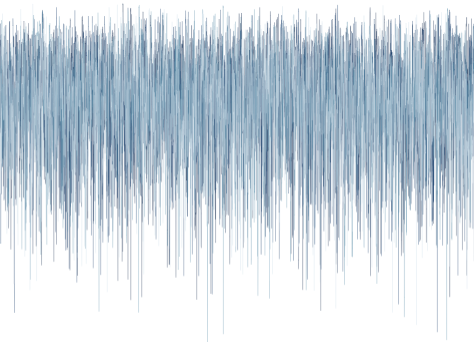

class: middle center

```{r setup, include=FALSE}
knitr::opts_chunk$set(echo = TRUE,
                      comment="")
```

```{r echo=FALSE, message=FALSE}
library(tidyverse)
library(bayesrules)
library(rstanarm)
library(bayesplot)
library(kableExtra)
theme_set(theme_gray(base_size = 18))
```

```{r xaringan-panelset, echo=FALSE}
xaringanExtra::use_panelset()
```


        
.large[`r fontawesome::fa(name = "link")`] <a href = "http://minedogucu.com">minedogucu.com</a>  
.large[`r fontawesome::fa(name = "github")`] <a href = "http://github.com/mdogucu">mdogucu</a>   
.large[`r fontawesome::fa(name = "twitter")`] <a href = "http://twitter.com/MineDogucu">MineDogucu</a>  

---
class: center middle

```{r echo=FALSE, fig.align='center', out.width="25%", fig.alt="Stats 115 course logo with prior, likelihood, and posterior plots!"}

```

[Introduction to Bayesian Data Analysis](https://www.stats115.com)

---

```{r echo=FALSE, fig.align='center', out.width="68%", fig.alt="A table with list of majors that include Bayesian courses as part of the major. There are two majors that require a Bayesian course."}

```


<a href="https://arxiv.org/abs/2109.00848" style="font-size: 15px">Dogucu, M., & Hu, J. (2021). The Current State of Undergraduate Bayesian Education and Recommendations for the Future. arXiv preprint arXiv:2109.00848.</a>

---


class:center

```{r echo=FALSE, fig.align='center', out.width="25%", fig.alt="a hex shaped logo with shiny green-pink disco ball and purple starry background. There is text that says Bayes Rules!"}
knitr::include_graphics("img/bayes-rules-hex.png")
```


.pull-left[
<script src="https://use.fontawesome.com/releases/v5.15.1/js/all.js" data-auto-replace-svg="nest"></script>

<i class="fas fa-book fa-2x" aria-hidden="true" title="Book icon"></i>

[Bayes Rules! An Introduction to Applied Bayesian Modeling](https://bayesrulesbook.com)

]

.pull-right[

<i class="fab fa-r-project fa-2x" aria-hidden="true" title="R logo"></i>

[{bayesrules}](https://www.github.com/bayes-rules/bayesrules)
]


---

class: middle 

.pull-left[
.center[

 


Alicia Johnson          
.font-20[Macalester College]
        
[`r fontawesome::fa(name = "link")`](https://ajohns24.github.io/portfolio)
[`r fontawesome::fa(name = "github")`](https://github.com/ajohns24)

]
]

.pull-right[
.center[


Miles Ott  
.font-20[Twitter]

[`r fontawesome::fa(name = "link")`](https://milesott.com/)
[`r fontawesome::fa(name = "github")`](https://github.com/MilesOtt)
[`r fontawesome::fa(name = "twitter")`](https://twitter.com/Miles_Ott)

]
]

---

class: middle 

## Southern California Data Science Program

HDR DSC awards: \#2123366 \#2123380 \#2123384

```{r echo=FALSE, fig.alt="NSF logo", out.width = "10%", fig.align="center"}
knitr::include_graphics("img/nsf-logo.png")
```

Through this collaborative grant between University of California Irvine, California State University Fullerton, and Cypress College, a Bayesian course will be adopted at California State University Fullerton.

---

class: middle

```{css echo=FALSE}
.panelset {
  --panel-tab-foreground: whitesmoke;
  --panel-tab-active-foreground: whitesmoke;
  --panel-tabs-border-bottom: #00a1a1;
  --panel-tab-inactive-opacity: 0.5;}
```

.panelset.sideways[
.panel[.panel-name[Unit 1]

### Bayesian Foundations

.pull-right[


- Bayes' Rule
- The Beta-Binomial Bayesian Model
- Balance and Sequentiality in Bayesian Analysis
- Conjugate Families

]

.pull-left[

```{r echo=FALSE, fig.align='center', fig.height=3, fig.width=4, fig.alt="three curves on a single plot with no axis labeled. It is coloring scheme indicates its similarity to the previous plot with prior, scaled likelihood and posterior"}
plot_beta_binomial(1, 4, 13, 28) +
  theme(panel.grid = element_blank(),
        axis.title = element_blank(),
        axis.text = element_blank(),
        axis.ticks = element_blank(),
        panel.background = element_blank(),
        legend.position = "none") 
```
]

]

.panel[.panel-name[Unit 2]

### Posterior Simulation & Analysis


.pull-right[

```{r echo=FALSE, fig.align='center', out.width="100%", fig.alt="A traceplot with no axis labels. Traceplots have thin vertical lines with varying lengths."}

```


]


.pull-left[

- Grid Approximation

- The Metropolis-Hastings Algorithm

- Posterior Estimation

- Posterior Hypothesis Testing

- Posterior Prediction

]

]


.panel[.panel-name[Unit 3]

### Regression and Classification

.pull-right[

```{r echo=FALSE, fig.align='center', out.width="100%", fig.alt="A scatterplot with multiple regression lines passing through points. These regression lines are not all over the place, they are clustered with similar but varyin intercepts and slopes."}
knitr::include_graphics("img/unit3.png")
```

]


.pull-left[

- Normal Regression
- Poisson and Negative Binomial Regression
- Logistic Regression
- Naive Bayes Classification

]
]

.panel[.panel-name[Unit 4]

### Hierarchical Models

.pull-right[

```{r echo=FALSE, fig.align='center', out.width="100%", fig.alt="a figure showing hierarchy with a rectangle on top. With a set of arrows pointing downwards leading to a set of rectangles below which also have a set of arrows pointing downwards leading to a different set of rectangles."}
knitr::include_graphics("img/unit4.png")
```

]


.pull-left[

- Normal hierarchical models without predictors
- Normal hierarchical models with predictors
- Non-Normal Hierarchical Regression & Classification

]

]

]

---

class: middle

## Background of students taking the course

- Prerequisite: STATS 120C. Introduction to Probability and Statistics III
- Recommended: STATS 110. Statistical Methods for Data Analysis I
- Students: Data Science major (required), Statistics minor (elective)


---

class: middle center

## Big Picture

```{r echo=FALSE, fig.align='center', out.width="55%"}

```

---


class: middle

## Context

In Alison Bechdel’s 1985 comic strip The Rule, a character states that they only see a movie if it satisfies the following three rules ([Bechdel 1986](https://dykestowatchoutfor.com/the-essential-dtwof/)):

- the movie has to have at least two women in it;
- these two women talk to each other; and
- they talk about something besides a man.

--

Let $\pi$, a random value between 0 and 1, denote the unknown proportion of  movies that pass the Bechdel test (i.e. $\pi \in [0,1]$).

---

```{r, echo=FALSE}
## Code for facet_wrapped Beta-Binomial plots
### Plotting function
beta_binom_grid_plot <- function(data, likelihood = FALSE, posterior = FALSE){
  g <- ggplot(data, aes(x = pi, y = prior)) + 
    geom_line() + 
    geom_area(alpha = 0.5, aes(fill = "prior", x = pi, y = prior)) + 
    scale_fill_manual("", values = c(prior = "#f0e442", 
      `(scaled) likelihood` = "#0071b2", posterior = "#009e74"), breaks = c("prior", "(scaled) likelihood", "posterior")) + 
    labs(x = expression(pi), y = "density") + 
    theme(legend.position="bottom")
  
  if(likelihood == TRUE){
    g <- g + 
      geom_line(aes(x = pi, y = likelihood)) + 
      geom_area(alpha = 0.5, aes(fill = "(scaled) likelihood", x = pi, y = likelihood))
  }
  
  if(posterior == TRUE){
    g <- g + 
      geom_line(aes(x = pi, y = posterior)) + 
      geom_area(alpha = 0.5, aes(fill = "posterior", x = pi, y = posterior)) 
  }
  g
}
make_plot_data <- function(as, bs, ys, ns, labs_prior, labs_likelihood){
  ### Set up data to call in plot
  # Refinement parameter
  size <- 250
  
  # Model settings
  pi <- rep(seq(0,1,length=size), 9)
  
  # Prior parameters
  a <- rep(as, each = size*3)
  b <- rep(bs, each = size*3)
  # Data
  y <- rep(rep(ys, each = size), 3)
  n <- rep(rep(ns, each = size), 3)
  # Posterior parameters
  a_post <- y + a
  b_post <- n - y + b
  # Labels
  setting_prior      <- as.factor(rep(1:3, each = size*3))
  setting_likelihood <- as.factor(rep(rep(1:3, each = size), 3))
  levels(setting_prior)      <- labs_prior
  levels(setting_likelihood) <- labs_likelihood    
  # Prior, likelihood, posterior functions
  bfun1 <- function(x){dbinom(x = ys[1], size = ns[1], prob = x)}
  bfun2 <- function(x){dbinom(x = ys[2], size = ns[2], prob = x)}
  bfun3 <- function(x){dbinom(x = ys[3], size = ns[3], prob = x)}
  scale   <- rep(rep(c(integrate(bfun1, 0, 1)[[1]], integrate(bfun2, 0, 1)[[1]], integrate(bfun3, 0, 1)[[1]]), each = size), 3)
  prior      <- dbeta(x = pi, shape1 = a, shape2 = b)
  likelihood <- dbinom(x = y, size = n, prob = pi) / scale
  posterior  <- dbeta(x = pi, shape1 = a_post, shape2 = b_post)
  # Combine into data frame
  data.frame(setting_prior, setting_likelihood, pi, a, b, y, n, likelihood, prior, posterior)
}
plot_dat <- make_plot_data(
  as = c(5,1,14), bs = c(11,1,1), 
  ys = c(9,27,197), ns = c(20,60,438), 
  labs_prior = c("prior: Beta(5,11)", "prior: Beta(1,1)", "prior: Beta(14,1)"), 
  labs_likelihood = c("data: Y = 9 of n = 20", "data: Y = 27 of n = 60", "data: Y = 197 of n = 438"))
```

.pull-left[
```{r ch4-bechdel-priors, fig.width = 9, echo = FALSE}
plot_dat_sub <- plot_dat %>% filter(y == 9) %>% mutate(setting_prior = factor(setting_prior, 
                                                                              levels = c("prior: Beta(1,1)", "prior: Beta(5,11)", "prior: Beta(14,1)"),
                                                                              labels = c("Plot 1", "Plot 2", "Plot 3")))
g1 <- beta_binom_grid_plot(plot_dat_sub) + 
  facet_grid(~ setting_prior,
             labeller = label_value) + 
  theme(legend.position = "none")
g1
```

]

--

.pull-right2[
- **Feminist** thinks that women are not represented in movies often. 
- **Clueless** is unsure. 
- **Optimist** thinks that Bechdel is a low bar for representation of women in movies and thinks almost all movies pass the test.
- Can you match the plots with the personas?]

---

class: middle

## Plotting Beta Prior with `bayesrules` package

One can use the `plot_beta()` function in the `bayesrules` package to try different shape parameters. Example:

```{r fig.align="center", fig.height=3, eval = FALSE}
library(bayesrules)
plot_beta(alpha = 2, beta = 10) 
```

```{r fig.align="center", fig.height=3, echo = FALSE}
plot_beta(alpha = 2, beta = 10) +
  theme(text = element_text(size=20)) 

```

---

## Plotting Beta Prior

```{r echo = FALSE, message = FALSE, fig.align='center'}
library(tidyverse)
# Set up beta data
alpha <- c(1,1,3,1,5,20,7,2,5)
beta  <- c(5,2,7,1,5,20,3,1,1)
betas <- data.frame(setting = factor(rep(1:9, 
                                         each = 500)), 
                    x = rep(seq(0, 1, 
                                length = 500), 9),
                    alpha = rep(alpha, each = 500),
                    beta = rep(beta, each = 500))
betas <- betas %>% 
  mutate(y = dbeta(x, shape1 = alpha, shape2 = beta))
levels(betas$setting) <-
  paste0("Beta(",alpha,",",beta,")")
trend_data <- data.frame(alpha, beta,
                         means = (alpha / (alpha +
                                             beta)),
                         modes = 
                           ((alpha - 1) / 
                              (alpha + beta - 2))) %>% 
  mutate(Parameter = 
           paste0("Beta(",alpha,",",beta,")")) %>% 
  mutate(setting = Parameter) %>% 
  mutate(means_d = dbeta(means, alpha, beta), 
         modes_d = dbeta(modes, alpha, beta))
trend_data$setting <- factor(trend_data$setting, 
                             levels = c("Beta(1,5)",
                                        "Beta(1,2)",
                                        "Beta(3,7)",
                                        "Beta(1,1)",
                                        "Beta(5,5)",
                                        "Beta(20,20)",
                                        "Beta(7,3)",
                                        "Beta(2,1)",
                                        "Beta(5,1)"))
  
ggplot(betas, aes(x = x, y = y)) + 
  lims(x = c(0,1), y = c(0,5.5)) + 
  geom_line() + 
  facet_wrap(~ setting) + 
  labs(x = expression(pi), y =
         expression(paste("f(",pi,")"))) + 
  scale_x_continuous(breaks = c(0,0.25,0.5,0.75,1),
                     labels =
                       c("0","0.25","0.50","0.75","1")) +
  theme(text = element_text(size=20)) 
```

---


```{r, echo=FALSE, message=FALSE}
## Remove
## Code for facet_wrapped Beta-Binomial plots
### Plotting function
beta_binom_grid_plot <- function(data, likelihood = FALSE, posterior = FALSE){
  g <- ggplot(data, aes(x = pi, y = prior)) + 
    geom_line() + 
    geom_area(alpha = 0.5, aes(fill = "prior", x = pi, y = prior)) + 
    scale_fill_manual("", values = c(prior = "#f0e442", 
      `(scaled) likelihood` = "#0071b2", posterior = "#009e74"), breaks = c("prior", "(scaled) likelihood", "posterior")) + 
    labs(x = expression(pi), y = "density") + 
    theme(legend.position="bottom")
  
  if(likelihood == TRUE){
    g <- g + 
      geom_line(aes(x = pi, y = likelihood)) + 
      geom_area(alpha = 0.5, aes(fill = "(scaled) likelihood", x = pi, y = likelihood))
  }
  
  if(posterior == TRUE){
    g <- g + 
      geom_line(aes(x = pi, y = posterior)) + 
      geom_area(alpha = 0.5, aes(fill = "posterior", x = pi, y = posterior)) 
  }
  g
}
make_plot_data <- function(as, bs, xs, ns, labs_prior, labs_likelihood){
  ### Set up data to call in plot
  # Refinement parameter
  size <- 250
  
  # Model settings
  pi <- rep(seq(0,1,length=size), 9)
  
  # Prior parameters
  a <- rep(as, each = size*3)
  b <- rep(bs, each = size*3)
  # Data
  x <- rep(rep(xs, each = size), 3)
  n <- rep(rep(ns, each = size), 3)
  # Posterior parameters
  a_post <- x + a
  b_post <- n - x + b
  # Labels
  setting_prior      <- as.factor(rep(1:3, each = size*3))
  setting_likelihood <- as.factor(rep(rep(1:3, each = size), 3))
  levels(setting_prior)      <- labs_prior
  levels(setting_likelihood) <- labs_likelihood    
  # Prior, likelihood, posterior functions
  bfun1 <- function(x){dbinom(x = xs[1], size = ns[1], prob = x)}
  bfun2 <- function(x){dbinom(x = xs[2], size = ns[2], prob = x)}
  bfun3 <- function(x){dbinom(x = xs[3], size = ns[3], prob = x)}
  scale   <- rep(rep(c(integrate(bfun1, 0, 1)[[1]], integrate(bfun2, 0, 1)[[1]], integrate(bfun3, 0, 1)[[1]]), each = size), 3)
  prior      <- dbeta(x = pi, shape1 = a, shape2 = b)
  likelihood <- dbinom(x = x, size = n, prob = pi) / scale
  posterior  <- dbeta(x = pi, shape1 = a_post, shape2 = b_post)
  # Combine into data frame
  data.frame(setting_prior, setting_likelihood, pi, a, b, x, n, likelihood, prior, posterior)
}
plot_dat <- make_plot_data(
  as = c(5,1,14), bs = c(11,1,1), 
  xs = c(6,29,46), ns = c(13,63,99), 
  labs_prior = c("prior: Beta(5,11)", "prior: Beta(1,1)", "prior: Beta(14,1)"), 
  labs_likelihood = c("data: Y = 6 of n = 13", "data: Y = 29 of n = 63", "data: Y = 46 of n = 99"))
```


```{r echo = FALSE, fig.align='center'}
plot_dat_new <- plot_dat %>% 
  mutate(setting_prior = factor(setting_prior, 
                                levels = c("prior: Beta(14,1)", "prior: Beta(5,11)", "prior: Beta(1,1)")))
beta_binom_grid_plot(plot_dat_new, posterior = TRUE, likelihood = TRUE) + 
  facet_grid(setting_prior ~ setting_likelihood) +
  theme(text = element_text(size=17)) 
```


---

class: middle

```{r}
one_mh_iteration <- function(w, current){
 # STEP 1: Propose the next chain location
 proposal <- runif(1, min = current - w, max = current + w)
  
 # STEP 2: Decide whether or not to go there
 proposal_plaus <- dnorm(proposal, 0, 1) * dnorm(6.25, proposal, 0.75)
 current_plaus  <- dnorm(current, 0, 1) * dnorm(6.25, current, 0.75)
 alpha <- min(1, proposal_plaus / current_plaus)
 next_stop <- sample(c(proposal, current), 
  size = 1, prob = c(alpha, 1-alpha))
  
 # Return the results
 return(data.frame(proposal, alpha, next_stop))
}
```

---


```{r cache=TRUE}
mh_tour <- function(N, w){
  # 1. Start the chain at location 3
  current <- 3
  # 2. Initialize the simulation
  mu <- rep(0, N)
  # 3. Simulate N Markov chain stops
  for(i in 1:N){    
    # Simulate one iteration
    sim <- one_mh_iteration(w = w, current = current)
    
    # Record next location
    mu[i] <- sim$next_stop
    
    # Reset the current location
    current <- sim$next_stop
  }
  
  # 4. Return the chain locations
  return(data.frame(iteration = c(1:N), mu))
}
```

---

```{r cache=TRUE}
set.seed(84735)
mh_simulation_1 <- mh_tour(N = 5000, w = 1)
```

.pull-left[
```{r echo=FALSE, , fig.height=5}
ggplot(mh_simulation_1, aes(x = mu)) + 
  geom_histogram(aes(y = ..density..), color = "white", bins = 20) + 
  stat_function(fun = dnorm, args = list(4,0.6), color = "red")
```
]

.pull-right[
```{r echo=FALSE, fig.height=5}
ggplot(mh_simulation_1, aes(x = iteration, y = mu)) + 
  geom_line()
```
]

---


class: middle

## `library(rstan)`


.pull-left[
```{r}
# STEP 1: DEFINE the model
stan_bike_model <- "
  data {
    int<lower=0> n;
    vector[n] Y;
    vector[n] X;
  }
  parameters {
    real beta0;
    real beta1;
    real<lower=0> sigma;
  }
  model {
    Y ~ normal(beta0 + beta1 * X, sigma);
  }
"
```

]


.pull-right[

```{r eval=FALSE}
# STEP 2: SIMULATE the posterior
stan_bike_sim <- 
  stan(model_code = stan_bike_model, 
  data = list(n = nrow(bikes), 
              Y = bikes$rides, X = bikes$temp_feel), 
  chains = 4, iter = 5000*2, seed = 84735)
```

]

---

class: middle

## `library(rstanarm)`


```{r eval=FALSE}
normal_model_sim <- stan_glm(rides ~ temp_feel, 
                             data = bikes, 
                             family = gaussian, 
                             chains = 4, iter = 5000*2,
                             seed = 84735)
```

```{r cache=TRUE, echo=FALSE}
normal_model_sim <- 
  stan_glm(rides ~ temp_feel, 
           data = bikes, 
           family = gaussian, 
           chains = 4, iter = 5000*2,
           seed = 84735,
           refresh = FALSE)
```

---

class: middle

## Pedagogical Approach

- Checking intuition 

--

- Active learning (quizzes and applications)

--

- Computing & math together

--

- Compute for a single case, then use built-in functions

--

- [Accessible and Inclusive](https://arxiv.org/abs/2110.06355)


---


class: middle

- [Undergraduate Bayesian Education Resources](https://undergrad-bayes.netlify.app/)

--

- [Undergraduate Bayesian Education Network](https://undergrad-bayes.netlify.app/network.html)


---

class: middle center

# THANK YOU

.large[
[bit.ly/dogucu-talks](https://bit.ly/dogucu-talks)
]

.large[`r fontawesome::fa(name = "twitter")`] <a href = "http://twitter.com/MineDogucu">MineDogucu</a>  


